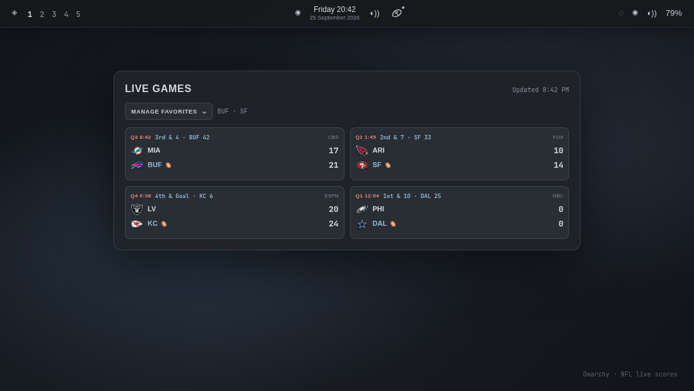

# Omarchy NFL Scores

An Omarchy shell bar widget for live NFL scores and the upcoming schedule.



The preview uses real team logos with illustrative game scores and situations.

## Features

- Compact football icon with a theme-colored live indicator when NFL games are
  in progress.
- Live game status, quarter/time, broadcast network, scores, and possession.
- Current down, distance, and field position for live games when ESPN provides
  the data, shown in the existing compact game-card header.
- Upcoming matchups with kickoff information when no games are live.
- Favorite teams sort to the top of the displayed game grid.
- Collapsible favorite-team manager with a clear-all control.
- Automatic refresh every 30 seconds.
- Cached scores and schedule when ESPN is temporarily unavailable.
- Scrollable layout for busy game days.

## Installation

```bash
omarchy plugin add https://github.com/carried-away/omarchy-nfl-scores.git --enable
```

The widget is placed in the center section of the bar by default. Click the
football icon to open the scoreboard. Middle-click refreshes it immediately.
Select **Manage favorites** to choose teams; they are saved locally between
sessions and sorted to the top of the game grid. The live dot appears whenever
at least one game is in progress.

## Removal

```bash
omarchy plugin remove ray.nflscores
```

## Dependencies

The plugin uses tools included with a standard Omarchy installation:

- `bash`
- `curl`
- `jq`

Scores and team logos are provided by ESPN's public API. No account or API key
is required. Favorite-team settings are stored in
`~/.local/state/omarchy/settings/nflscores.json`.

## License

MIT. See [LICENSE](LICENSE).
